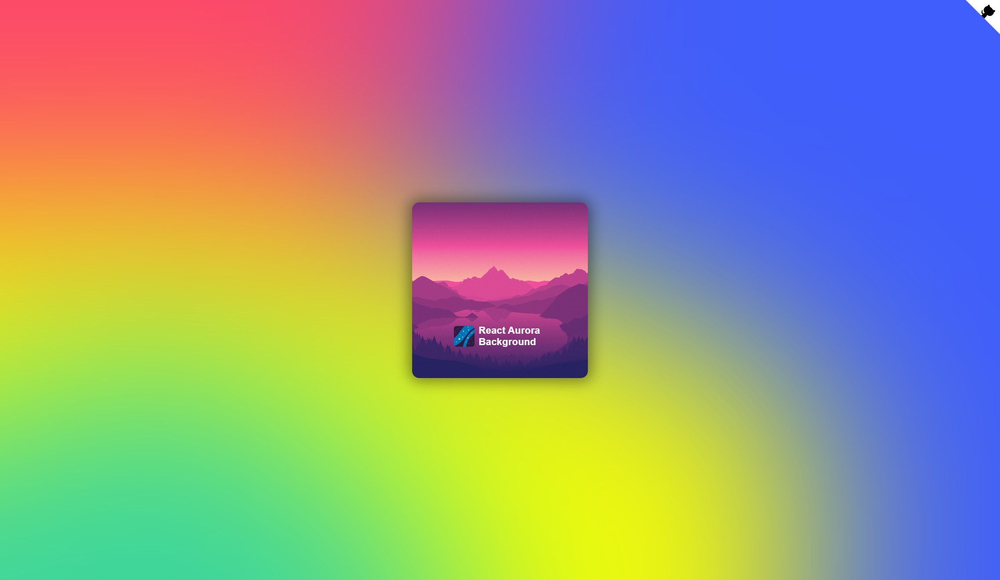

# 🌌 React Aurora Component

My personal, lightweight, customizable and beautiful take for the typical background aurora effect we see in some websites using the glassmorphism style. Plug and play!



## 🎞️ Demo

You can see it working by yourself in this little demo: [https://thenaubit.github.io/react-aurora-background/](https://thenaubit.github.io/react-aurora-background/)

## ✨ Features

- Uses TypeScript by default.
- It has both ESM and CJS modules, as well as type definitions.
- Minimal - Almost no dependencies!
- Fast
- SSR compatible! (and of course, it works in Next.JS 13 as a Server Component!)
- Customizable. Change everything. Colors, speed, blur...
- Compatible. It works in Chrome, Edge, Firefox, Webkit... desktop and mobile devices!

## 🔧 How to install?

Just type this in your terminal:

```
npm install @nauverse/react-aurora-background
```

Or in case you are using `yarn`:

```
yarn add @nauverse/react-aurora-background
```

Also for `pnpm`:

```
pnpm i @nauverse/react-aurora-background
```

## ❓ How to use it?

Just wrap your app with it, like another provider.

```javascript
// 1. Import the provider
import { AuroraBackgroundProvider } from '@nauverse/react-aurora-background';

const MyApp = () => {
  return (
    // 2. Wrap your app with the provider and done!
    <AuroraBackgroundProvider>
      // The rest of your app
    </AuroraBackgroundProvider>
  );
};
```

If you want an example, you can check this [one](https://github.com/TheNaubit/react-aurora-background/blob/main/docs/docs.tsx).

### 🛠️ Settings

You can set some props to the provider to customize the behavior:
|Prop Name |Description |Default Value |
|--- |--- |--- |
|colors |It contains an array of color strings (hex, rgb or rgba) that will be used in the aurora background. |["#FC466B", "#3f5efb", "#F8FF00", "#3AD59F"] |
|numBubbles |It is the number of bubbles that creates the aurora effect. It can be an integer between 2 and 9 (both inclusive). I recommend to pick a number closer to the middle for the best experience. |4 |
|animDuration |It is a number greater than 0 (can be decimal). It is the duration in seconds of the aurora animation before it loops. |5 (seconds) |
|blurAmount |It can be a number or a string. It specifies the amount of blur the aurora will have. It sets a backdropFilter CSS property so the value must be a valid CSS value. If you pass a number, it will be converted to pixels by appending a "px" string after the number. If you pass a string, it must be a valid CSS value (like "5vw", "100%"...). |"10vw" |
|bgColor |It is the color of the background of the div containing the aurora. It is a color string (hex, rgb or rgba). |"#3f5efb" |
|useRandomness |It is a boolean. If enabled, instead of using always the same values for width, height and animation-delay properties on each bubble item, it will add some small randomness. |false |
|className |An optional string containing the extra class/classes to be added to the container. |<empty> |
|style |An optional object containing styles to be added to the container. |<empty> |

## 🐛 Bugs, Issues and Contributing

This is an Open Source package so feel free to create an Issue or a Pull Request (or even to Fork it) if you want!

## 🐣 About me!

Find me on Twitter: [@naucode](https://twitter.com/naucode)

## 💭 Changelog

- **v1.0.12:** Improved the internal structure 🔧
- **v1.0.11:** Added extra props and fixed build issues 🔧
- **v1.0.10:** Updated dependencies and fixed broken links 🔗
- **v1.0.9:** Improved default settings ✨
- **v1.0.8:** Fixed Firefox support 🔧
- **v1.0.7:** Fixed iOS blur issue 🔧
- **v1.0.6:** Added some performance improvements (now we use the GPU when possible) ✨
- **v1.0.5:** Fixed optimization in bubble items 🔧
- **v1.0.4:** Fixed build generation - part 2 🔧
- **v1.0.3:** Fixed build generation 🔧
- **v1.0.2:** Fixed demo link 🔧
- **v1.0.1:** Fixed docs 🔧
- **v1.0.0:** This is the first public version of the package, let's go! 🚀
